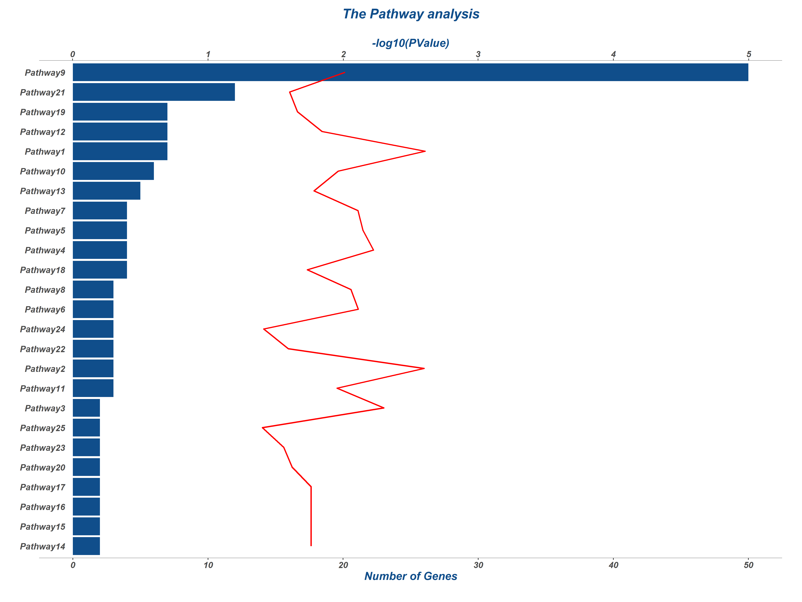
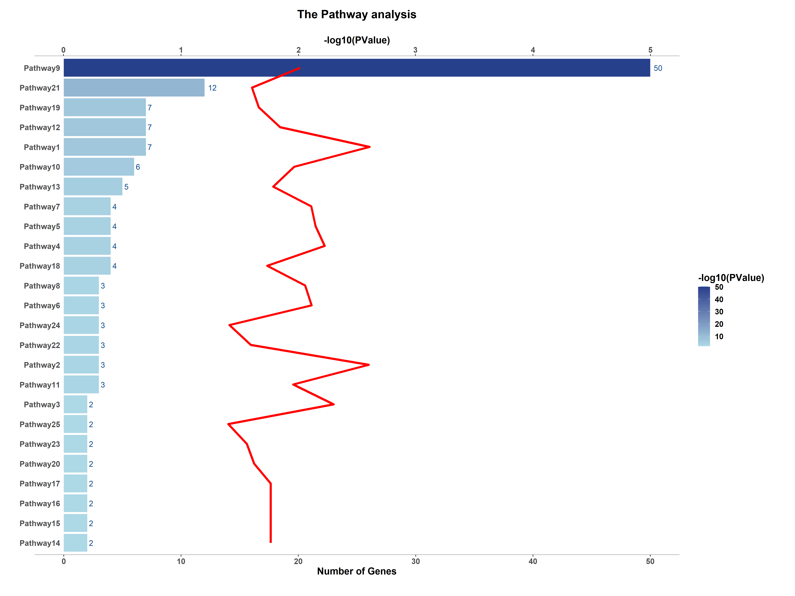
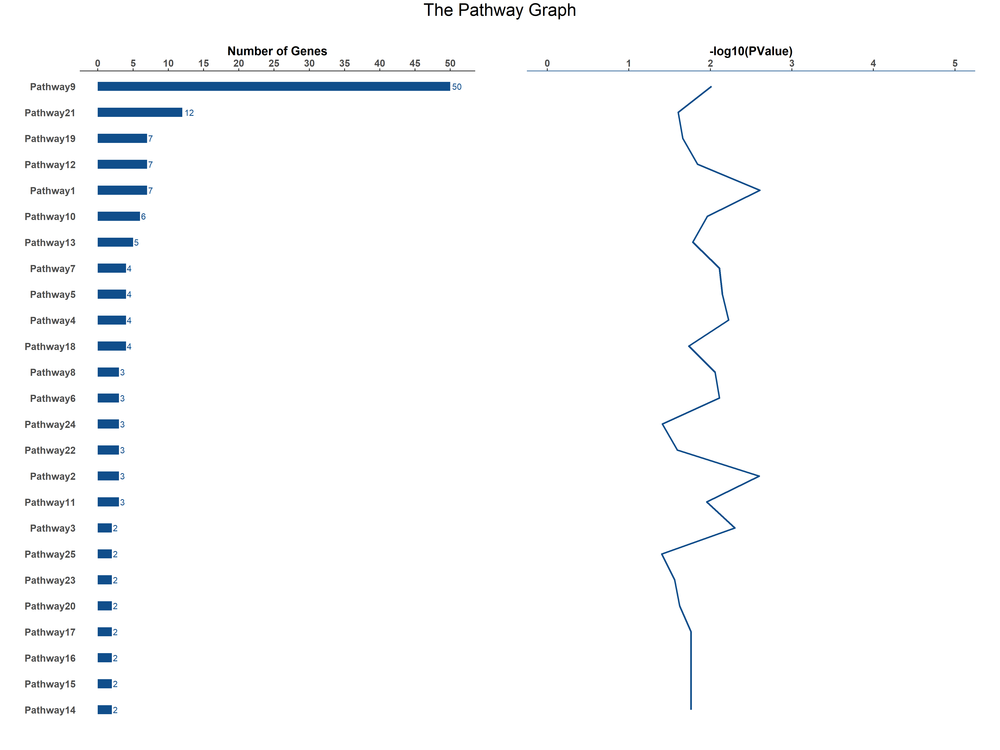

# Overlaying Plots in R
1. Single Color Plot

2. Color Gradient Plot 

3. Two seperate graphs (optional)

# Reference
1. <a href="https://biostats.w.uib.no/secondary-y-axis/" target="_blank"> Secondary Y-axis </a>
2. <a href="http://www.stat.columbia.edu/~tzheng/files/Rcolor.pdf" target="_blank"> Color Palette</a>
3. <a href="https://www.r-graph-gallery.com/267-reorder-a-variable-in-ggplot2.html"> Reorder a variable with ggplot2 </a>
4. <a href="https://cran.r-project.org/web/packages/forcats/vignettes/forcats.html" target="_blank"> Reorder factor levels by sorting along another variable</a>
4. <a href="https://stackoverflow.com/questions/37840861/adjust-the-distance-between-x-labels-and-the-chart-using-ggplot2" target="_blank"> Adjust the distance between x labels and the chart using ggplot2 </a>
5. Inspired by <a href="https://github.com/JoanClaverol/tidytuesday/blob/master/data/2020/2020-06-02/code.R" target="_blank">JoanClaverol</a>'s Marble Racing (#TidyTuesday)

